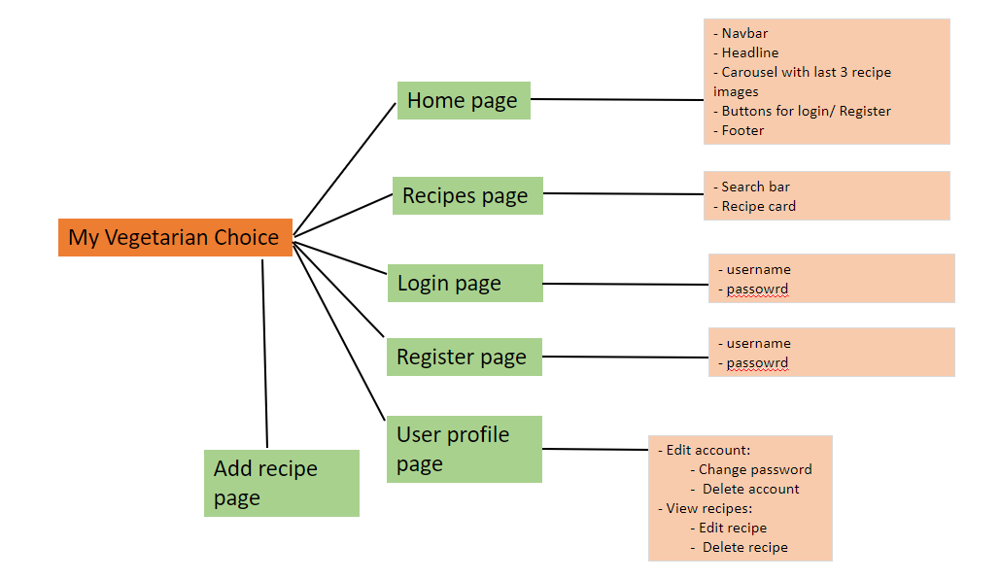
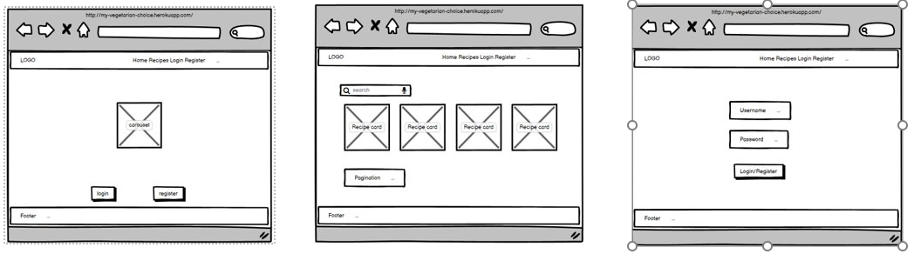

# My Vegetarian Choice


[View the live project here](https://my-vegetarian-choice.herokuapp.com/)

### Table of contents
1. [UX](#UX)
     1. [Project Goals](#Project-Goals)
     2. [User Stories](#User-Stories)
     3. [Development Planes](#Development-Planes)
2. [Database Info](#Database-Info)
     1. [Users Collection](#Users-Collection)
     2. [Recipes Collection](#Recipes-Collection)
3. [Features](#Features)
     1. [Design Features](#Design-Features)
4. [Technologies Used](#Technologies-Used)
     1. [Languages](#Languages)
     2. [Tools](#Tools)
     3. [Libraries](#Libraries)
     4. [Database Management](#Database-Management)
5. [Testing](#Testing)
     1. [Testing.md](testing.md)
6. [Deployment](#Deployment)
     1. [1. Database Creation](#1-Database-Creation)
     2. [2. Local Copy Creation](#2-Local-Copy-Creation)
     3. [3. Heroku App Creation](#3-Heroku-App-Creation)
7. [Credits](#Credits)
8. [Acknowledgements](#Acknowledgements)
9. [Technical Support](#Technical-Support)
***

## UX 
### Project Goals
The main goal of **My Vegetarian Choice** is to provide a web-based application, that is simplistic and intuitive in design, which allows users to **create**, **search**, **update** and share their **favourite** vegetarian recipes.

This is the third of four Milestone Projects that the developer must complete during their Full Stack Web Development Program at The Code Institute. 

The main requirements were to build a full-stack web application that allows users to manage a common dataset (in this instance, vegetarian recipes) using **HTML5**, **CSS3**, **JavaScript**, **Python**, **Flask** and **MongoDB**.

#### User Goals
The user is looking for:
- A database where the user can find recipes.
- An easy-to-use user management system with **CRUD** conventions to:

    - Create a user account.
    - View user account.
    - Update their passord.
    - Delete their user account.

- An easy-to-use dataset management system with **CRUD** conventions to:

    - Create recipes.
    - Read recipes.
    - Update their own recipes.
    - Delete their own recipes.

- A simple and easy to navigate design.

#### Developer Goals
As a developer, I am looking to:

- Create an application where users can post, edit and delete their own recipes.
- Add a new application to my portfolio.
- Improve my newly learned languages and skills.

### User Stories
**As a General User, I want to:**

1. Easily find recipes on the database. 
2. View the details of each recipe.

**As a Non-Registered User, I want to:**

1. Register an account.

**As a Registered User, I want to:**

1. Log into my account to be able to create, edit and delete recipes.
2. Navigate to my user profile to change my password.
3. Navigate to my account settings to delete my account.
4. Navigate to my recipes page to view my uploaded recipes.
6. Navigate to my own recipes to edit recipe as needed.
7. Navigate to my own recipes to delete recipe.

**As an Administrative Account holder, I want to:**

1. Edit **any** recipes created by users.
2. Delete **any** recipes from the dashboard.

### Development Planes

In order to develop and promote an interactive web application, My Vegetarian Choice has been created based on::

#### Strategy
The targeted audience:
- New Users **(Non-Registered)**
- Returning Users **(Registered)**
- Individuals who want to find a recipe.
- Individuals who want to create a recipe.
- Age group: suitable for any age group

The website needs to enable the **user** to:
- Register/Login to an account
- Edit their account
- Delete their account
- Search Recipe database by:
    - Name/Phrase
    - Ingredient
- View Recipe Dashboard with the following information:
    - Name
    - Image
    - Category
    - Serving Size
    - Time
    - Ingredients
    - Cooking method
    - The user who created the recipe
- Upload and access their own recipes

#### Scope
After defining the strategy, the scope was developed based on the following requirements:
- **User Requirements**
     - The user will be looking for:
        - Customisable and Editable account:
            - Custom Username/Password
            - Manage their account
            - Upload their own recipes
            - Manage their own recipes
        - Easy Navigation
        - Recipe dashboard:
            - Name
            - Image URL
            - Category
            - Serving Size
            - Time
            - Who created the recipe
            - Ingredients
            - Cooking method
        - Searchable database system

- **How the user requirements have been met**
     - The user will be able to:
        - Register/Login to account
        - Edit their profile:
            - Edit Password
            - Delete their account
            - Upload their own recipes
            - Edit and delete their recipes
        - Navigate to recipes:
            - Search by name or ingredient
            - My Recipes Page
        - Create their recipes, providing:
            - Name
            - Image URL
            - Category
            - Serving Size
            - Time
            - Ingredients
            - Cooking Method

#### Structure
With the previously identified strategy and scope, the ideal structure was agreed to match the following diagram:


#### Skeleton
**Skeleton** has been put together using [Balsamiq wireframes](https://balsamiq.com/ "Link to Balsamiq wireframes"):


#### Surface

- <strong>Colour Scheme</strong>

     - The developer has chosen to use blue for navbar and orange for links and buttons.
     
     


- <strong>Typography</strong>

    - The font used for the LOGO is 'Pacifico', with cursive as fallback.
    - The font used for Menu is 'Roboto', with sans-serif as fallback.

## Database info

For this project, the NoSQL database [MongoDB](https://www.mongodb.com/ "Link to MongoDB") was used to store the dataset. For this, two collections were created:

### Users Collection
- When registering an account, the user provides:
     - Username (unique identifier)
     - Password (hashed)

### Recipes Collection
- When creating a recipe, the user provides:
     - Recipe Name
     - Recipe Image (via URL)
     - Category
     - Serving
     - Time
     - Ingredients
     - Method
- The Ingredients and Method are arrays, allowing data to be entered dynamically.

## Design Features

Each page of the website features a consistently responsive and intuitive navigational system:
- There is a conventionally placed **navbar** on the top of each page with easily accessible and identifiable navigation links with a clickable logo, redirecting users back to the home page.
     - On mobile and tablet screens, the navbar is located in a conventionally placed 'hamburger' menu.
- The **Footer** displays the information regarding the use of copyrighted material on the website.
- [Jinja](http://jinja.pocoo.org/docs/2.10/ "Link to Jinja information") was used to extend the `base.html` page, allowing functionality across all pages. The extended block elements created the same basic layout for each page:

     ```
     <nav>
          <!-- Navigational content -->
     </nav>

     <section>

          
               <!-- Page Banner Image and Title -->
          

          
               <!-- Appropriate flash messages -->
          

          
               <!-- Content unique to each page -->
          

     </section>

     <footer>
          <!-- Footer content -->
     </footer>
     ```

- If the user is in session, there will be additional links added to the `navbar`:
     - Profile
     - Add a Recipe
     - Logout

- On mobile and tablet screens, the extra buttons will appear on the navigation (hamburger) menu in order to provide quick access.


- Recipe **Cards** are used throughout the website, providing users with a snapshot of the recipe, name category and who created it, before they view the entire recipe page. Each card is designed the same for consistency purposes and allows the user to click on the recipe name in order to be directed to the recipe page.