<h1 align="center"> Testing </h1>

[Return to README.md file](README.md "Link to README file")

[View live project](https://my-vegetarian-choice.herokuapp.com// "Link to Live project")

[View Repository](https://github.com/cosminaserbanica/CI-MS3-MyVegetarianChoice "Link to Repository")

***
### Table of contents
1. [Testing User Stories](#Testing-User-Stories)
2. [Manual Testing](#Manual-Testing)
    1. [Common Elements Testing](#Common-Elements-Testing)
    2. [Page Elements Testing](#Page-Elements-Testing)
3. [Automated Testing](#Automated-Testing) 
     - [Code Validation](#Code-Validation)
     - [Browser Validation](#Browser-Validation)
4. [Test Recipe](#Test-recipe)

## Testing User Stories

### General User

**1. The General user wants to view the contents.**

- **The Recipes** page is visible on all pages througout the site.
- On clicking the **Recipes** page, users will be able to view all recipes.
- The **Search Bar** allows the users to search for recipes.

**2. The General user wants to view details of each recipe**

- Users can click either the **Recipe Name** to navigate to the recipe's page.
- On the **Recipe** page the user can find details of the full recipe.

### Non-Registered User

**1. The Non Registered user** can easily navigate to the Register page to create an account.

- A Non-Registered User can click the **Register** call-to-action button located on the **Home Page**, or in the **Navigation Links** to be directed to the **Register** page.
- There, they can enter their username and password to create an account.
- On registering, they will be directed to the **Profile Page**.

### Registered User

**1. The Registered user can easily navigate to the Log In** page to access their account.

- Users can click the **Login** call-to-action button on the **Home Page**, or in the **Navigation Links** to be directed to the **Login Page**.
- There, they can enter their login details.
- Once logged in, they will be directed to their **Profile** page.

**2. The Registered User can easily navigate to their profile**

- On **Profile Page**, the user can navigate to their **Edit Profile** page.
- There, they can change their password or Delete their account
- On selecting **Delete account** a modal will open.

**3. The Registered User can navigate to their recipes page to view the recipes they have created.**

- When logging in, they user be directed to their **Profile** page.
- There, they can view their recipes.

**5. The Registered User can add recipes to the database.**

- Once logged in, the conditional link of **Add a recipe** will appear in the navbar.
- There the user can create a new recipe.

**6. The registered user can edit their own recipe.**

- Once clicking on **View my recipes** on the user profile page, the user will be directed to **My Recipes** page.
- There, the user can click on the **Edit** button from the recipe card, which will direct them to the **Edit Recipe page**.

**7. The Registered User can delete their own recipe from the dashboard and from the database.**

- Once clicking on **View my recipes** on the user profile page, the user will be directed to **My Recipes** page.
- There, the user can click on the **Delete** button from the recipe card, which will open a modal.

### Admin:

**1. The Admin can view any recipe on the dashboard.**

- The Admin can monitor all recipes entered.

**2. The Admin can delete any recipe as needed.**

- Each Recipe the Admin is viewing displays a conditional link in the form of a bin icon, which allows the Admin to delete that recipe.

## Manual Testing

### Home page

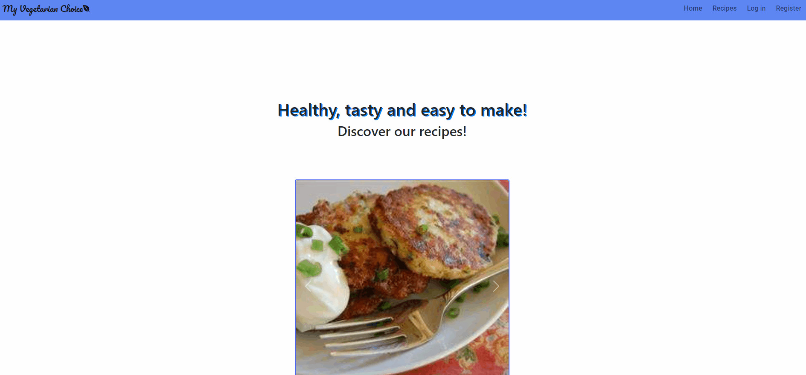
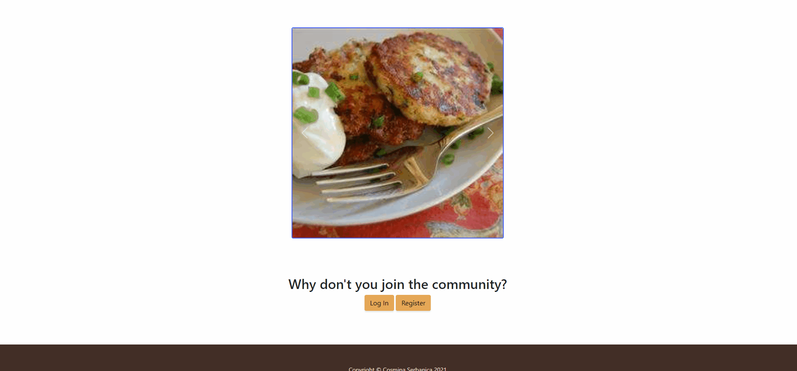
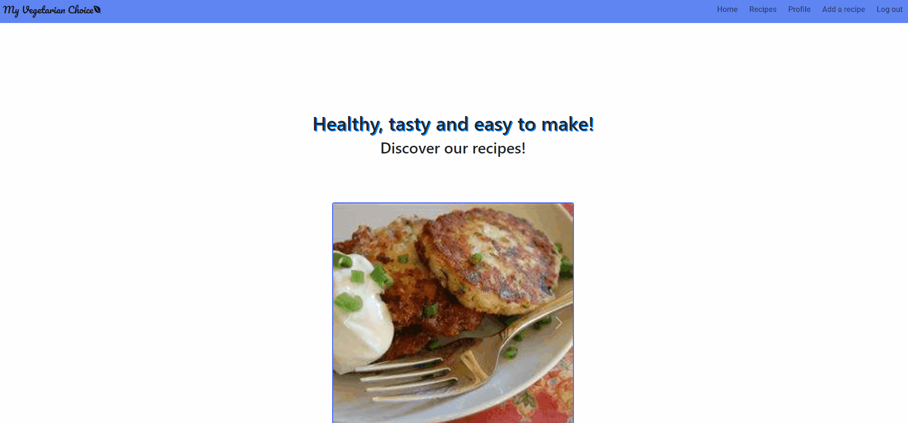
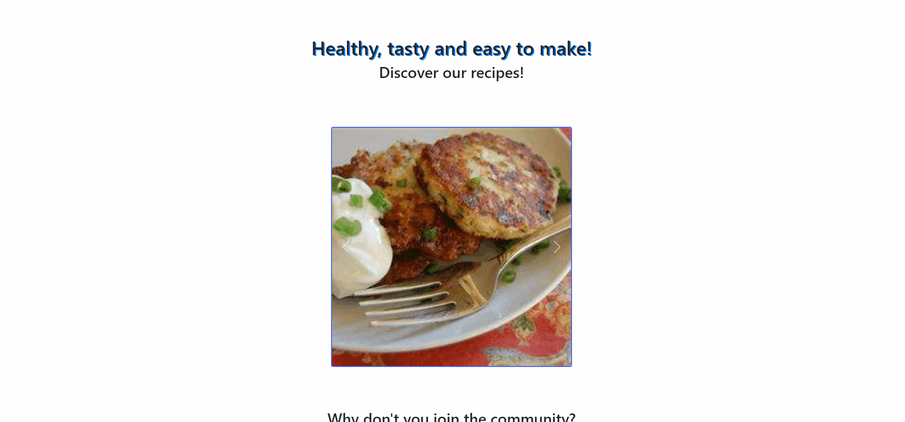

### Recipes page

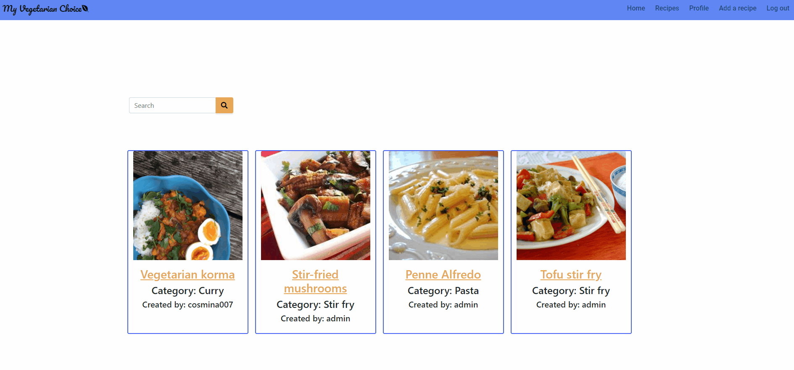
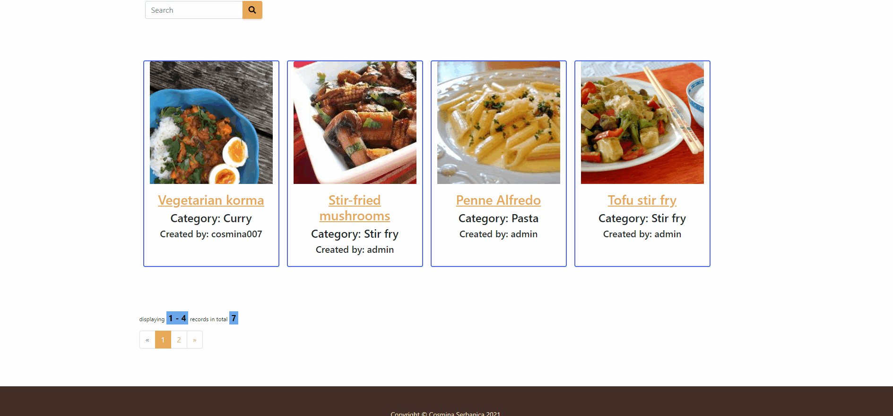

### Register

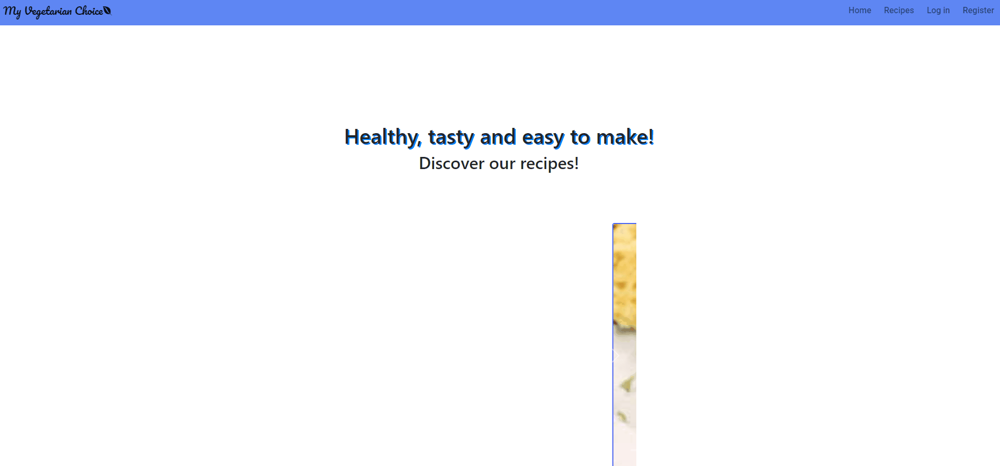

### Login

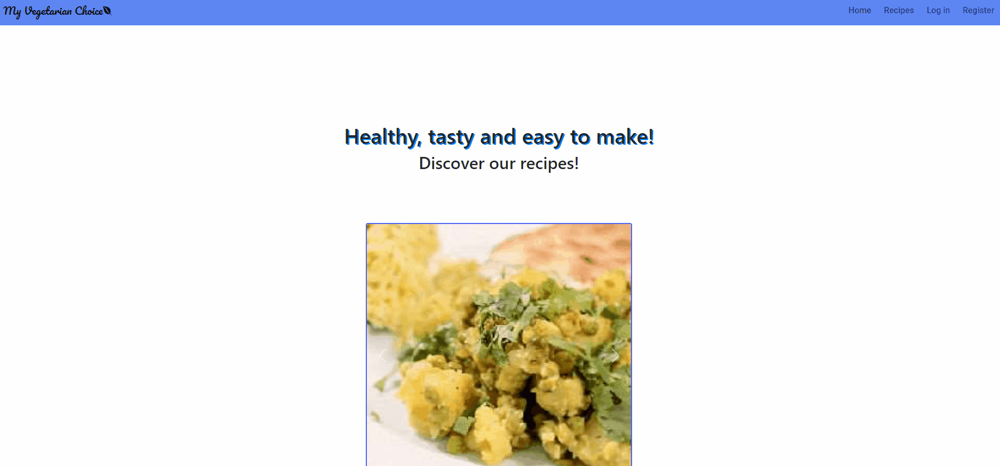

### Logout

### Add a recipe

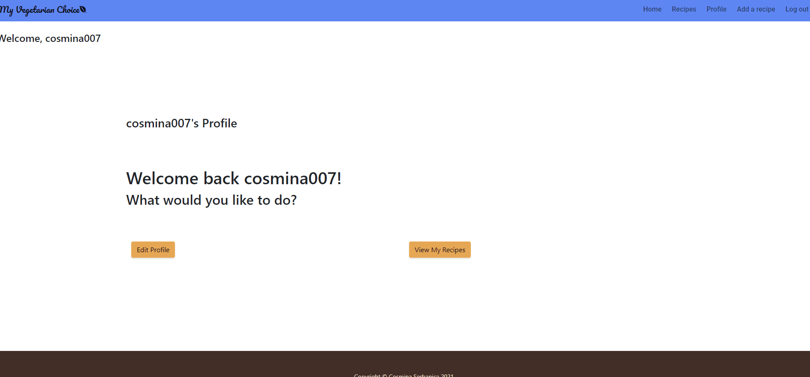

### Edit profile

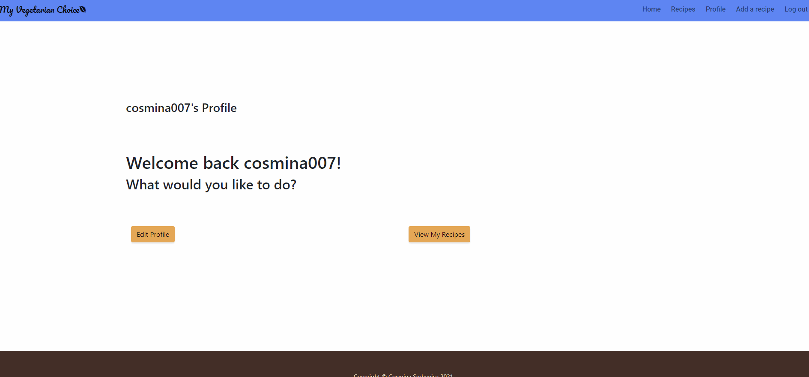

### View my recipes

## Automated Testing

### Code Validation

[W3C Markup Validator](https://validator.w3.org/ "Link to W3C Markup Validator") was used to validate the `HTML` code to achieve the following result:
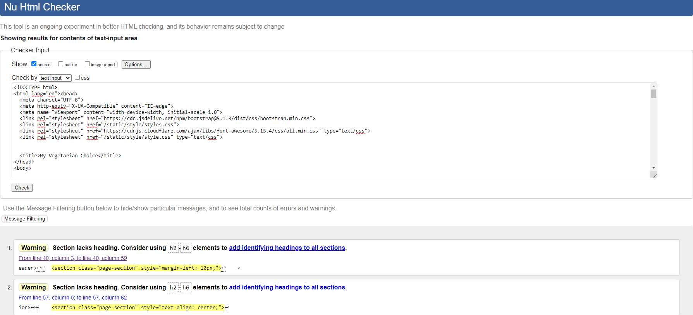
[W3C CSS Validator](https://jigsaw.w3.org/css-validator/ "Link to W3C CSS Validator") was used to validate the `CSS` code to achieve the following result:
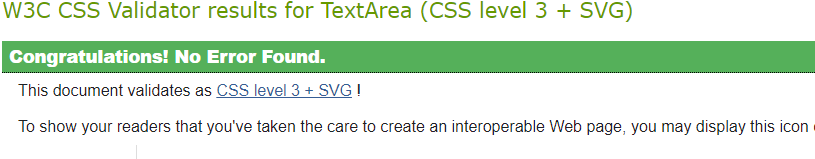
[PEP8 online](https://pep8online.com/ "Link to W3C CSS Validator") was used to validate the `Python` code to achieve the following result:
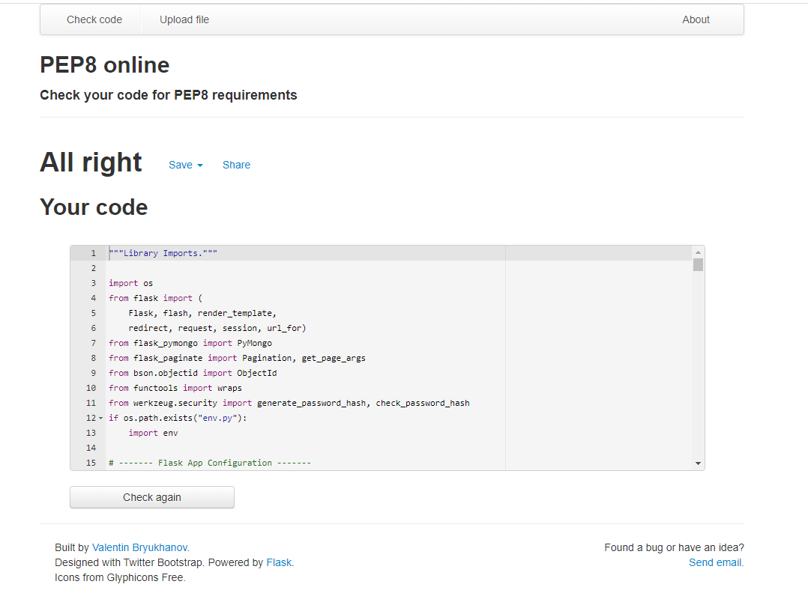
[PEP257](https://www.python.org/dev/peps/pep-0257/ "Link to PEP257") compliance to docstring convention was ensured:
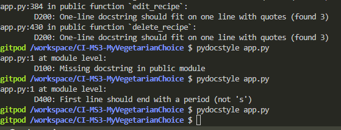

### Browser Validation

The application was succesfully tested on **Chrome**, **Mozilla Firefox**, **Opera** and **Safari**.

## Test Recipe

To enable the assesor to test the full functionality of the application, the developer has decided to post the following recipe that the assessor can use:

| Type | Content |
|:----:|----------|
| Name | Gazpacho pasta salad |
| Image URL | http://ukcdn.ar-cdn.com/recipes/port960/c0fb8e65-5120-48db-b079-5115f5cb3246.jpg |
| Category | Pasta |
| Time | 30 mins |
| Serving | 6 |
|Ingredients |225g (8 oz) fusilli pasta|
| | 4 spring onions, chopped
| | 1 green pepper, chopped |
| | 1 jalapeño chilli, seeded and minced |
| | 2 tomatoes, chopped |
| | 1 cucumber |
| | 175ml (6 fl oz) tomato juice |
| | 4 tablespoons fresh lime juice |
| Method | Cook fusilli according to package instructions; drain.|
| | In large bowl combine pasta, onion, green pepper, jalapeño and the rest of the ingredients. |
| | Toss well and chill in refrigerator for 2 hours. Toss again before serving. |
